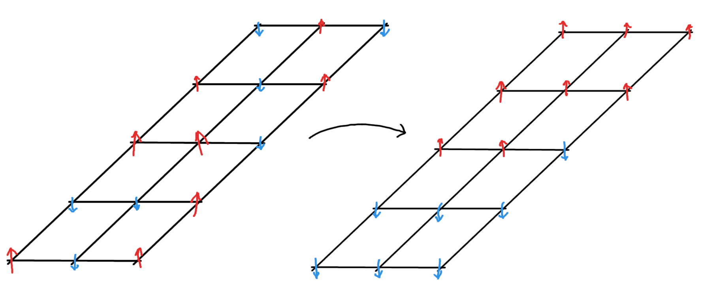

---

##### Download

+ [Paper](https://doi.org/10.1184/R1/29361008.v1)

---

##### Abstract

The gradient theory of phase transitions dates back to the work of van derWaals in the late 19th century and its rediscovery by Cahn & Hilliard in the 1950s. In the intervening century, the theory has been developed and expanded into numerous directions and fields. In particular, in the late 20th century, Alberti & Bellettini considered a model for phase transitions driven by non-local rather than gradient energies. Such models arise, for instance, as continuum limits of Ising spin systems in the study of magnetic phase transitions.

This thesis explores the theory of non-local phase transitions, in particular focusing on the non-linear theory 1 < p < +∞, and on interaction kernels with singularities such as those leading to Gagliardo seminorms for fractional Sobolev spaces. First, the existence and uniqueness of optimal profiles in the diffuse interface problem is established. Then, asymptotic analysis is performed via Γ-convergence to show that the diffuse interface energies converge to an anisotropic surface energy localized on the interface between the two phases. Finally, heuristic arguments for the homogenization problem are given to conjecture the limit energy for non-local phase transitions with periodic microscale variations.

---

##### Figure: Magnetic Phase Transitions



---

##### Citation

Caldwell, Wesley (2025). Non-Local Phase Transitions. Carnegie Mellon University. Thesis. https://doi.org/10.1184/R1/29361008.v1

```BibTeX
@thesis{NLPT25,
author = {Caldwell, Wes},
type = {Ph.D. Thesis},
year = {2025},
title ={Non-Local Phase Transitions},
school = {Carnegie Mellon University},
doi = {10.1184/R1/29361008.v1}}
```
