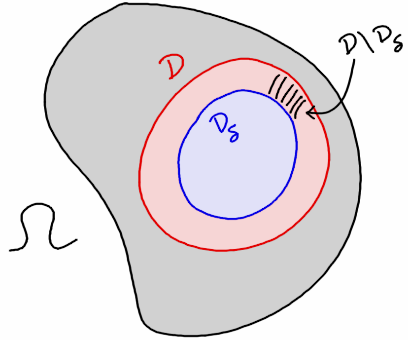

---

##### Download

+ [Paper](https://doi.org/10.1051/cocv/2025017)

---

##### Abstract

In this paper, the study of a non-local Cahn–Hilliard-type singularly perturbed family of functionals is undertaken, generalizing known results by Alberti & Bellettini [Eur. J. Appl. Math. 9 (1998) 261–284]. The kernels considered include those leading to Gagliardo seminorms for fractional Sobolev spaces, as studied by Savin & Valdinoci [Ann. Inst. Henri Poincaré C, Analyse Non Linéaire 29 (2012) 479–500]. In this way, this paper can be viewed as a combination of the contributions of Alberti & Bellettini and Savin & Valdinoci. The limit energy is computed via Γ-convergence and shown to be an anisotropic surface energy on the interface between the two phases.

---

##### Figure: The Modification Theorem



---

##### Citation

Caldwell, Wes 2025. "Non-local phase transitions with singular anisotropic kernels" *ESAIM: COCV* 31 (32)

```BibTeX
@article{CaldwellESAIM25,
    author = {Wes Caldwell},
    year = {2025},
    title = {Non-local phase transitions with singular anisotropic kernels},
    journal = {ESAIM: COCV},
    volume = {31},
    number = {32},
    url = {https://doi.org/10.1051/cocv/2025017}
}
```
+ [Presentation slides](presentation2.pdf)
+ [Wikipedia entry](https://en.wikipedia.org/wiki/The_Finer_Points_of_Sausage_Dogs)
